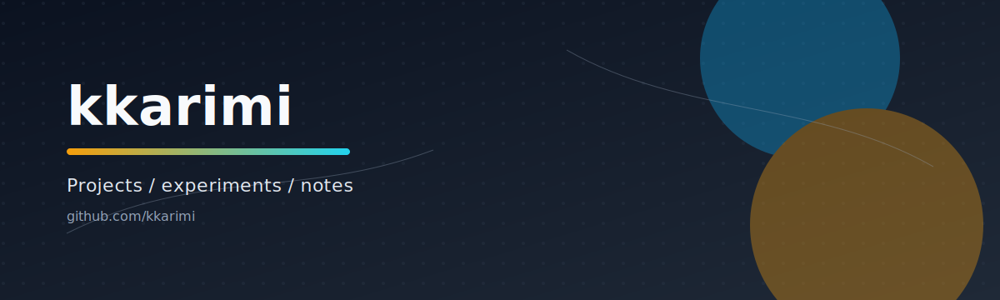

  

  <a href="https://github.com/kkarimi">github.com/kkarimi</a>

## Overview
Snapshot of recent work and activity, updated automatically.

## Metrics

  

## Notes
- Metrics image is generated by `/.github/workflows/metrics.yml`.
- Update `METRICS_TOKEN` in repo secrets for broader access, otherwise it falls back to `GITHUB_TOKEN`.
